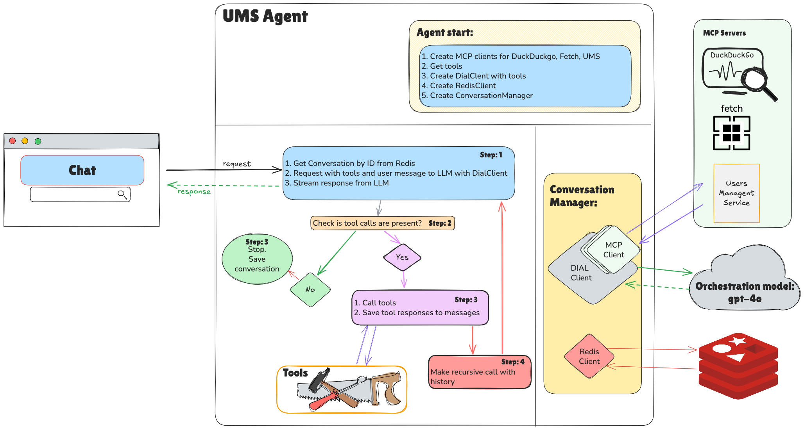

# Final Task: Users Management Agent

In this task, you will build a **production-ready Agent** with the Tool Use pattern connected to several MCP servers,
equipped with skills and Users PII protection (guardrail).
The agent supports both streaming and non-streaming responses, stores all conversations in Redis, and serves a
browser-based chat UI.

---

## Branches Structure

- `final-task-completed` — full implementation (reference)
- `main` — tasks with descriptions *(coming soon)*
- `main-detailed` — tasks with super detailed descriptions *(coming soon)*

---

### UI


### Application architecture


---

## Prerequisites

- Node.js 18+
- Docker (for UMS service, MCP servers, Redis)
- `OPENAI_API_KEY` environment variable

---

## Tasks

### 1. Implement the UMS User Management Skill

Open [_skills/ums-user-management/SKILL.md](task/_skills/ums-user-management/SKILL.md) and read the skill spec.
The frontmatter is already complete — no changes needed here.

---

### 2. Implement `McpTool`

Open [agent/tools/mcp_tool.ts](task/agent/tools/mcp_tool.ts) and implement all `TODO` items.

A `BaseTool` that delegates execution to an `BaseMcpClient`. Stores a `BaseMcpClient` and a `McpToolModel` and
forwards `_execute()` calls to `client.callTool()`.

---

### 3. Implement `ReadSkillTool`

Open [agent/tools/read_skill_tool.ts](task/agent/tools/read_skill_tool.ts) and implement all `TODO` items.

A local `BaseTool` that reads skill files from the `_skills/` directory by relative path.
The agent calls it to load `SKILL.md` instructions before acting on a request.

---

### 4. Implement `HttpMcpClient`

Open [agent/clients/http_mcp_client.ts](task/agent/clients/http_mcp_client.ts) and implement all `TODO` items.

Uses the `@modelcontextprotocol/sdk` `Client` with `StreamableHTTPClientTransport` to connect to an HTTP MCP server,
list its tools, and call them.

---

### 5. Implement `StdioMcpClient`

Open [agent/clients/stdio_mcp_client.ts](task/agent/clients/stdio_mcp_client.ts) and implement all `TODO` items.

Uses the `@modelcontextprotocol/sdk` `Client` with `StdioClientTransport` to launch a Docker container as an MCP
server, list its tools, and call them.

---

### 6. Implement `UMSAgent`

Open [agent/ums_agent.ts](task/agent/ums_agent.ts) and implement all `TODO` items.

Wraps the OpenAI `AsyncOpenAI` client and drives the **Tool Use** loop:
- `response()` — non-streaming completion with recursive tool calling
- `streamResponse()` — streaming completion that yields SSE chunks, handles tool call deltas, notifies the frontend
  about each tool call and result, then recursively streams the next response

---

### 7. Implement `ConversationManager`

Open [agent/conversation_manager.ts](task/agent/conversation_manager.ts) and implement all `TODO` items.

Manages the full conversation lifecycle backed by **Redis**:
- `createConversation()` / `listConversations()` / `getConversation()` / `deleteConversation()`
- `chat()` — loads history from Redis, injects the system prompt on the first turn, delegates to
  `UMSAgent.response()` or `UMSAgent.streamResponse()`, then persists the updated message list

---

### 8. Implement `app.ts`

Open [agent/app.ts](task/agent/app.ts) and implement all `TODO` items.

Fastify application that on startup:
1. Loads skills from `_skills/` and builds the system prompt
2. Connects `HttpMcpClient` to the UMS MCP server and registers its tools
3. Connects `StdioMcpClient` to the DuckDuckGo MCP server and registers its tools
4. Creates `UMSAgent`, connects to Redis, creates `ConversationManager`

REST endpoints:
- `POST /conversations` — create conversation
- `GET /conversations` — list conversations
- `GET /conversations/:id` — get conversation
- `DELETE /conversations/:id` — delete conversation
- `POST /conversations/:id/chat` — chat (streaming or non-streaming)

---

### 9. Implement `index.html`

Open [task/index.html](task/index.html) and implement all `TODO` items.
This is the browser-based chat UI.

#### Conversation request flow


---

### 10. Run Infrastructure and Start the Application

1. Start the infrastructure:
   ```bash
   docker compose -f t13_final_task/docker-compose.yml up -d
   ```

2. Install dependencies (if not already done):
   ```bash
   npm install
   ```

3. Start the agent:
   ```bash
   npm run t13
   ```
   The server starts on `http://localhost:8011`.

4. Open `t13_final_task/task/index.html` in your browser.

---

### Sample Requests

```
Find all users with the surname "Smith"
```

```
Add Elon Musk as a new user
```

```
Update the email for user with ID 42
```

```
Delete user with ID 777 — make sure to confirm first
```

```
Search the web for the latest news about OpenAI and summarize it
```

---

### 11. Implement `guardrail.ts` (Additional Task)

**Since the agent works with PII, it must prevent credit card and salary data from leaking back to the UI.**

Open [agent/guardrail.ts](task/agent/guardrail.ts) and implement `UMSDataGuardrail.redact()`.

The guardrail uses regex patterns to detect and redact:
- **Credit card numbers** (num, cvv, exp_date fields from UMS)
- **Salary values** in YAML-like, JSON, Python-dict, and plain-text formats

`UMSAgent` calls `guardrail.redact()` on every tool result before it is appended to the conversation history.

---

## Redis Insight

- Connect to Redis Insight at `http://localhost:6380`
- Add a database with URL `redis-ums:6379` to browse conversation data

---

**Congratulations! You've built an agent backed by multiple MCP servers, Redis persistence, a browser UI, and PII guardrails.**
