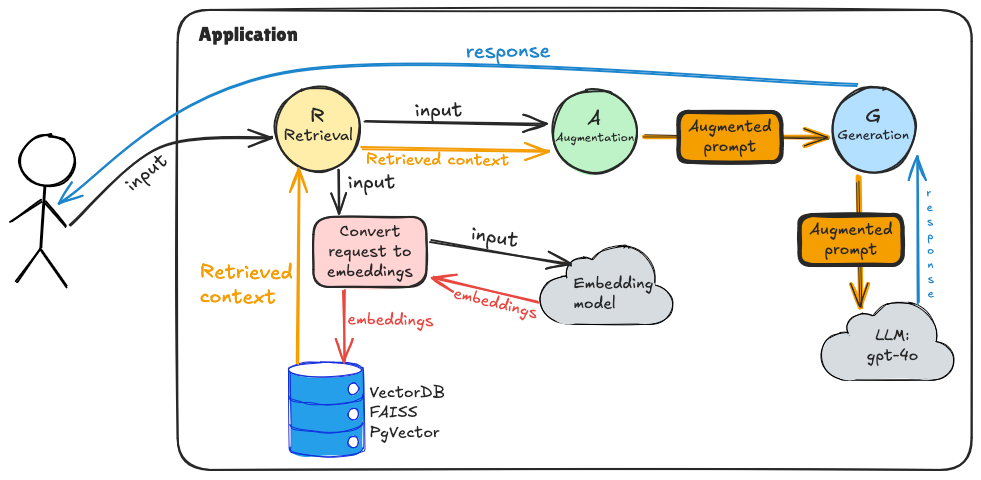

# RAG (Retrieval-Augmented Generation) Implementation

A TypeScript implementation task to build a complete RAG system for microwave manual assistance using LangChain, FAISS, and OpenAI.

---

## Understanding the RAG Pipeline

Your implementation will demonstrate the complete RAG workflow:

1. **🔍 Retrieval**: Find relevant chunks from the microwave manual based on the user query
2. **🔗 Augmentation**: Combine retrieved context with the user question in a structured prompt
3. **🤖 Generation**: Use an LLM to generate an accurate answer based on the provided context

## Application diagram:



---

## Setup

```bash
npm install
```

Run the application:

```bash
npm run ts t4_rag_fundamentals/app.ts
```

---

## Task

### If the task on the `main` branch is hard, switch to `main-detailed` for step-by-step guidance.

- OpenAI Embeddings API: https://platform.openai.com/docs/guides/embeddings
- LangChain OpenAI Embeddings: https://js.langchain.com/docs/integrations/text_embedding/openai
- LangChain ChatOpenAI: https://js.langchain.com/docs/integrations/chat/openai
- LangChain FAISS: https://js.langchain.com/docs/integrations/vectorstores/faiss
- LangChain RecursiveCharacterTextSplitter: https://js.langchain.com/docs/concepts/text_splitters

Complete the implementation in [app.ts](app.ts) by filling in all the `TODO` sections:

### 🔍 **Step 1: Vector Store Setup (`setupVectorStore` method)**
- Check if the FAISS index already exists locally
- Load the existing index or build a new one
- Handle both scenarios properly

### 📖 **Step 2: Document Processing (`createNewIndex` method)**
- Load [microwave_manual.txt](microwave_manual.txt) using `TextLoader`
- Split documents into chunks using `RecursiveCharacterTextSplitter`
- Create a FAISS vector store from the document chunks
- Save the index locally for future use

### 🔎 **Step 3: Context Retrieval (`retrieveContext` method)**
- Implement similarity search using `similaritySearchWithScore`
- Extract and format relevant document chunks
- Return the formatted context for the LLM

> You can experiment with these parameters in `retrieveContext`:
>
> `k` — number of relevant chunks to retrieve
>
> `scoreThreshold` — maximum L2 distance to accept (lower = stricter)
>
> `chunkSize` / `chunkOverlap` — tune chunk granularity in `createNewIndex`

### 🔗 **Step 4: Prompt Augmentation (`augmentPrompt` method)**
- Format the user prompt with the retrieved context
- Structure the prompt according to the RAG template

### 🤖 **Step 5: Answer Generation (`generateAnswer` method)**
- Build the message list for the LLM
- Invoke the LLM and return the generated answer

### ⚙️ **Step 6: Main Configuration**
- Set up `OpenAIEmbeddings` with the correct model
- Configure `ChatOpenAI`
- Initialise `MicrowaveRAG` and await `rag.ready` before starting the loop

---

## Testing Your Implementation

### Valid request samples:
```
What is the maximum cooking time that can be set on the microwave?
```
```
What are the steps to set the clock time on the microwave?
```
```
What is the ECO function on this microwave and how do you activate it?
```
```
What should you do if food in plastic or paper containers starts smoking during heating?
```
```
What is the recommended procedure for removing odors from the microwave oven?
```

### Invalid request samples (should be rejected by the RAG guardrail):
```
What do you know about the DIALX Community?
```
```
What do you think about the dinosaur era? Why did they die?
```
