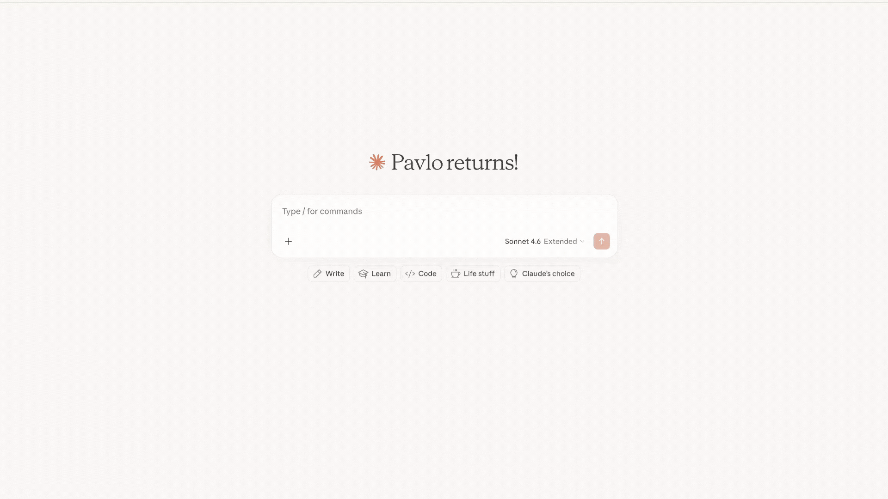

# MCP Fundamentals (Server & Client)

TypeScript implementation for building Users Management Agent with MCP tools and MCP server

**Run from the repository root:**

| Component | Command |
|---|---|
| HTTP MCP Server | `npm run t9:server` |
| STDIO MCP Server | `npm run t9:server-stdio` |
| Agent | `npm run t9:agent` |

---

## Learning Goals

By exploring and working with this project, you will learn:

- How to configure simple MCP server
- How to configure client and connect to MCP server
- How to create simple Agent with tools from MCP server
- Key features of MCP

---

**Run from the repository root:**

| Component | Command |
|---|---|
| HTTP MCP Server | `npm run t9:server` |
| STDIO MCP Server | `npm run t9:server-stdio` |
| Agent | `npm run t9:agent` |

---

### If the task in the main branch is hard for you, switch to the `main-detailed` branch

---


---

# Tasks:

## HTTP

You need to implement the Users Management Agent, that will be able to perform CRUD operations within User Management
Service.

### 1. Create and run HTTP MCP server:

1. Run User Service [root docker-compose](docker-compose.yml) (Optional step in case if you have it from previous tasks)
2. Open [_server.ts](mcp_server/_server.ts) and implement all ***TODO***
3. Open [httpServer.ts](mcp_server/httpServer.ts) and **Run** it

<details> 
<summary><b>OPTIONAL: Work with HTTP MCP server in Postman</b></summary>


</details>

### 2. Create and run Agent:

1. Open [base mcp_client](agent/mcp_clients/base.ts) and implement all ***TODO***
2. Open [HTTP mcp_client](agent/mcp_clients/http.ts) and implement all ***TODO***
3. Open [agent.ts](agent/agent.ts) and implement all ***TODO***
4. Open [prompts](agent/prompts.ts) and write System prompt
5. Open [app](agent/app.ts) and implement all ***TODO***
6. Run application [app.ts](agent/app.ts) and test that it is connecting to MCP Server and works properly
7. Try with your solution with `fetch MCP` `https://remote.mcpservers.org/fetch/mcp` instead of http://localhost:8005/mcp

### OPTIONAL: Support both (users-management and fetch) MCP servers:

1. Remember that we have 1-to-1 connection between MCP client and MCP server!
2. You need to think of the way how to change current flow to support tools from different MCP servers and implement it
3. In the end you should have the Agent that is able to fetch the info from the WEB about some people and save it to
   Users Service
4. Hint: the problem place is [agent](agent/agent.ts)

---

## STDIO

### 1. Create and run Agent with STDIO MCP Client:

1. Open [STDIO mcp_client](agent/mcp_clients/stdio.ts) and implement all ***TODO***
2. Open [app](agent/app.ts) and instead of `HttpMCPClient` use this one:
    ```typescript
    const mcpClient: MCPClient = new StdioMCPClient({
        command: "npm",
        args: ["run", "ts", path.join(__dirname, "..", "mcp_server", "stdio_server.ts")],
        env: { ...process.env } as Record<string, string>,
    });
    ```
3. Run application [app.ts](agent/app.ts) and test that it is connecting to STDIO MCP Server and works properly

<details> 
<summary><b>Connecting Your STDIO MCP Server to Claude Desktop</b></summary>

This uses your `stdio_server.ts` entry point — simplest and most reliable for local development.

### Step 1: Find Claude Desktop config file

| OS          | Path                                                              |
|-------------|-------------------------------------------------------------------|
| **macOS**   | `~/Library/Application Support/Claude/claude_desktop_config.json` |
| **Windows** | `%APPDATA%\Claude\claude_desktop_config.json`                     |

### Step 2: Edit the config

Open the file (create it if it doesn't exist) and add your server:

```json
{
  "mcpServers": {
    "users-management": {
      "command": "{ABSOLUTE_PATH_TO_NODE}",
      "args": [
        "{ABSOLUTE_PATH_TO_PROJECT}/js-ai-applications-development-from-api-to-agents/node_modules/.bin/tsx",
        "{ABSOLUTE_PATH_TO_PROJECT}/js-ai-applications-development-from-api-to-agents/t9_mcp_fundamentals/mcp_server/stdio_server.ts"
      ]
    }
  }
}
```

**Important notes:**

- Replace `{ABSOLUTE_PATH_TO_NODE}` with the absolute path to your Node.js 18+ binary (e.g. `which node` in your terminal)
- Replace `{ABSOLUTE_PATH_TO_PROJECT}` with the absolute path to the project root on your local machine
- Using absolute paths is required because Claude Desktop launches subprocesses without sourcing your shell profile, so version managers like nvm/fnm/volta are not available and `npx` may resolve to an older system Node that lacks the global `fetch` API


<details> 
<summary><b>Sample how it is done on a Mac:</b></summary>

```json
{
  "mcpServers": {
    "users-management": {
      "command": "/Users/<your_username>/.nvm/versions/node/v22.22.0/bin/node",
      "args": [
        "/Users/<your_username>/dialx/courses/js-ai-applications-development-from-api-to-agents/node_modules/.bin/tsx",
        "/Users/<your_username>/dialx/courses/js-ai-applications-development-from-api-to-agents/t9_mcp_fundamentals/mcp_server/stdio_server.ts"
      ]
    }
  }
}
```


</details>

### Step 3: Restart Claude Desktop

Fully quit and reopen Claude Desktop. While reopen Claude can ask access to project. In connectors section you will be able to find users-management

</details>

<details> 
<summary><b>Play in Postman with your STDIO MCP Server</b></summary>

Configuration is the same as you have for Claude 👆


</details> 


### 2. Play with STDIO MCP Servers from docker images:

1. Use such mcp_client:
    ```typescript
    const mcpClient: MCPClient = new StdioMCPClient({ dockerImage: "mcp/duckduckgo:latest" });
    ```
2. It is an MCP Server with WEB Search capabilities, [source code](https://github.com/khshanovskyi/duckduckgo-mcp-server)
3. Try to search `What is the weather in Kyiv now?`